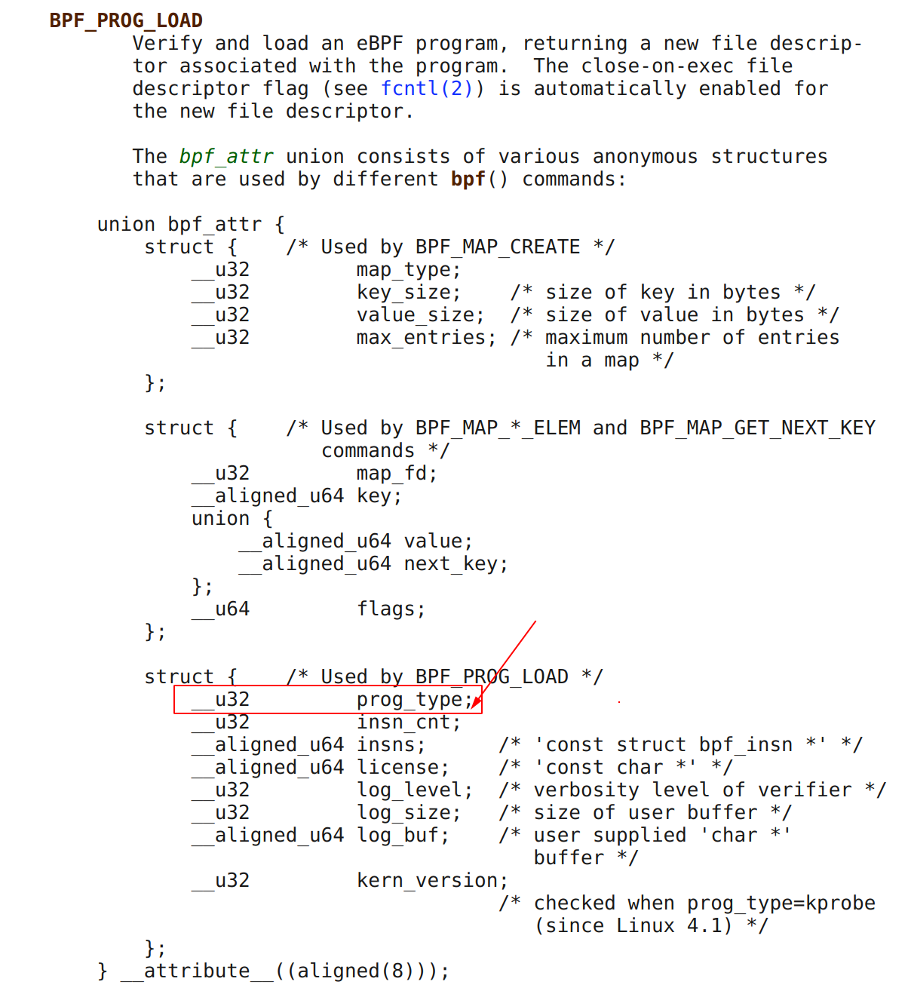
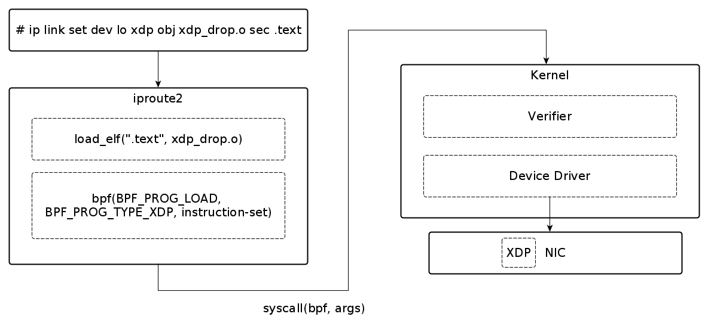

Problem Statement: Block TCP port 8080 
--------------------------------------
Block TCP port 8080

Using XDP to drop the packets matching port 8080 fastest way to handle this. Note that XDP operates at the interface ingress level. That is when the packets enter the interface they can be tested for conditions and a verb (DROP/PASS/REDIRECT/ABORT) can be associated. In our case, we match for port 8080 and DROP.

Note that there are many other ways of handling this problem statement:

1. Using **iptables/netfilter** drop rule
2. Dropping using **tc** (traffic classifier) using ebpf
3. Intercepting syscall **using LSM** and blocking the ``connect()`` syscall.
4. Intercepting glibc call **using LD_PRELOAD** and blocking the ``connect()`` call (after verifying that the connect target port is 8080) in userspace itself.
5. I chose **XDP** because its the fastest/optimal way to handle this job.

Well, technically blocking glibc call using LD_PRELOAD would be the most optimal way because it simply returns connect() call in the userspace itself! There will never be a single ``sk_buff`` alloced for the connection.

Step 1: Compile
~~~~~~~~~~~~~~~
Compile ebpf source_ for dropping the packet::

    $ clang -I/usr/include/x86_64-linux-gnu -O2 -target bpf -c src/xdp-drop.c -o xdp_drop.o
        ... [compile ebpf program]

Q. What are the differences as compared to regular C code?
**********************************************************
Ans: No difference except note the use of ``-target bpf`` and that we **only compile** the object code and there is **no linking**. By default on compilation the object file contains ``.text`` section containing the compiled program code. This ``.text`` section is what gets loaded as ebpf bytecode.

::

    $ readelf --sections xdp_drop.o
    Section Headers:
    [Nr] Name              Type             Address           Offset
        Size              EntSize          Flags  Link  Info  Align
    [ 0]                   NULL             0000000000000000  00000000
        0000000000000000  0000000000000000           0     0     0
    [ 1] .strtab           STRTAB           0000000000000000  00000108
        000000000000002e  0000000000000000           0     0     1
    [ 2] .text             PROGBITS         0000000000000000  00000040
        0000000000000068  0000000000000000  AX       0     0     8
    [ 3] .symtab           SYMTAB           0000000000000000  000000a8
        0000000000000060  0000000000000018           1     3     8

Note ``.text`` section which will be loaded. Another interesting thing to look at is the llvm-objdump which shows instruction code for the ``.text`` section.

::

    $ llvm-objdump -S xdp_drop.o
    xdp_drop.o:	file format ELF64-BPF

    Disassembly of section .text:
    xdp_drop:
        0:	b7 00 00 00 02 00 00 00 	r0 = 2
        1:	61 12 04 00 00 00 00 00 	r2 = *(u32 *)(r1 + 4)
        2:	61 11 00 00 00 00 00 00 	r1 = *(u32 *)(r1 + 0)
        3:	bf 13 00 00 00 00 00 00 	r3 = r1
        4:	07 03 00 00 36 00 00 00 	r3 += 54
        5:	2d 23 06 00 00 00 00 00 	if r3 > r2 goto +6 <LBB0_4>
        6:	71 12 17 00 00 00 00 00 	r2 = *(u8 *)(r1 + 23)
        7:	55 02 03 00 06 00 00 00 	if r2 != 6 goto +3 <LBB0_3>
        8:	b7 00 00 00 01 00 00 00 	r0 = 1
        9:	69 11 22 00 00 00 00 00 	r1 = *(u16 *)(r1 + 34)
        10:	15 01 01 00 1f 90 00 00 	if r1 == 36895 goto +1 <LBB0_4>

    LBB0_3:
        11:	b7 00 00 00 02 00 00 00 	r0 = 2

    LBB0_4:
        12:	95 00 00 00 00 00 00 00 	exit

Step 2: Load
~~~~~~~~~~~~
From earlier step, we have the bytecode object file ``xdp_drop.o`` and now we need to instruct the kernel to load this bytecode at the XDP hookpoint in the interface. Note that there are multiple ways (tools such as iproute2/tc/direct syscall from your userspace code) to load the bytecode into kernel.

Here we use ip (iproute2) to insert the bytecode.::

    $ sudo ip link set dev lo xdp obj xdp_drop.o sec .text
        ... [load bytecode using XDP on loopback interface]

The ``xdp obj xdp_drop.o sec .text`` instructs the ``ip`` command to load the ``.text`` section from the ``xdp_drop.o`` object file into the kernel.

Q. How does iproute2 internally load the bytecode?
**************************************************
Ans: iproute2 internally links with ``libelf.so`` to load the specified ELF section (``.text`` in our case) and instructs the kernel to load the bytecode using `bpf()`_ *bpf(int cmd \/\*BPF_PROG_LOAD\*\/, union bpf_attr \*attr, unsigned int size)* call. The ``bpf_attr->prog_type`` specifies ``BPF_PROG_TYPE_XDP`` specifies the XDP hookpoint.

Step 3: Verify
~~~~~~~~~~~~~~
Verify the loaded bytecode::

    $ ip link show dev lo
        ... [check the loaded ebpf-xdp code]
        1: lo: <LOOPBACK,UP,LOWER_UP> mtu 65536 xdpgeneric qdisc noqueue state UNKNOWN mode DEFAULT group default qlen 1000
            link/loopback 00:00:00:00:00:00 brd 00:00:00:00:00:00
            prog/xdp id 58  <------------ NOTE THIS LINE

Step 4: Test
~~~~~~~~~~~~
Test using netcat

In terminal1 start netcat in server mode::

    $ nc -l 8080

In terminal2 start netcat in client mode::

    $ echo hello | nc 127.0.0.1 8080

Outcome
~~~~~~~
If the xdp_drop.o is loaded then the 'hello' should not show up on the server, else it should.

.. _source: src/xdp-drop.c
.. _bpf(): http://man7.org/linux/man-pages/man2/bpf.2.html
